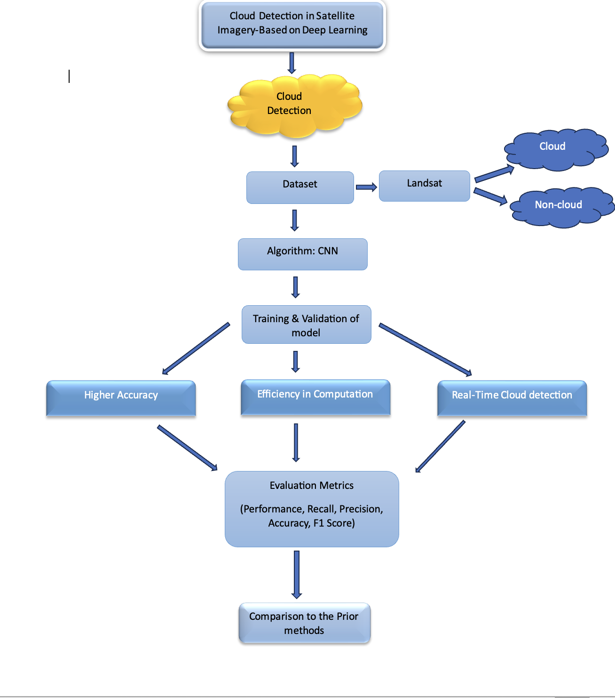

# Cloud Detection in Satellite Imagery

This project focuses on detecting clouds in satellite images using Deep Learning techniques.

---

## Project Workflow



---

## Features
- Detects cloud regions from satellite images
- Image preprocessing and prediction pipeline
- Deep Learning based classification

---

## Tech Stack
- Python
- TensorFlow / Keras
- OpenCV
- NumPy
- Matplotlib

---

## How to Run

```bash
pip install -r requirements.txt
python src/main.py

#Project Structure#

- `src/` → Contains the main code
- `images/` → Workflow diagram and outputs
- `reports/` → Project documentation
- `requirements.txt` → Required libraries

---

## Results
- Successfully detects cloud regions in satellite images
- Model performs classification on input satellite imagery
- Provides output with identified cloud areas

---

## Future Improvements
- Improve model accuracy using larger datasets
- Implement real-time cloud detection
- Deploy as a web application using Flask or Streamlit

